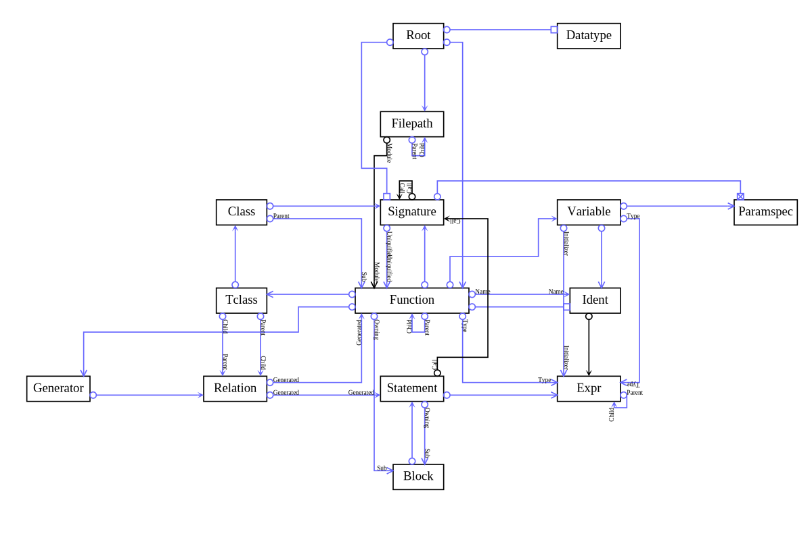

# Rune's HIR Database Design


<p style="text-align: center;"> *Data model for Rune's HIR* </p>

*   <sub>Lines between classes represent relations.</sub>
*   <sub>Blue arrows are cascade-delete.</sub>
*   <sub>Black arrows are non-cascade-delete.</sub>
*   <sub>Circles attach to parent class.</sub>
*   <sub>Thin arrows are `OneToOne` relations.</sub>
*   <sub>Thick Arrows are `LinkedList`, `DoublyLinked`, or `TailLinked`
    relations.</sub>
*   <sub>Boxes with X are `Array` relations.</sub>
*   <sub>Empty boxes are `Hashed` or `HashedClass` relations.</sub>

Classes are either parents or children of relationships. For example `Block`
(that is, a block consists of multiple statements) is the parent in the
`DoublyLinked relation from`Block`to`Statement`, and`Statement`is the parent in
the`Statement:Owning`->`Block:Sub` `OneToOne`relation For instance,
an`if-else`statement is represented with two consecutive`Statement`s on their
`parentBlock`, and each have one `subBlock`. By convention, we use Owning/Sub for
one-to-one relations and Parent/Child for one-to-many.

Rune's High-level IR database is the engine the powers the compiler, between
lowering the AST to HIR, and generating LLVM IR. Its design is meant to minimize
the code needed to write the Rune compiler, while helping that code be readable.

The balance between being too generic vs too specific is tricky. We could use
the AST directly as the HIR, but that would make the code hard to read, as
everything would be a Node, and the reader would have to know the semantic
meaning of Nodes at various positions. At the other extreme, we could have a
different class for every expression type, function type, datatype, and
statement type. This would be easy to read, but would bloat the compiler, making
enhancing the compiler difficult.

With a design similar to the one described in this doc, the C Rune compiler
manages to support the bootstrap compiler with less than 30K lines of C code.
With this design, the initial bootstrap Rune compiler written in Rune should
have similarly low complexity and good readability.

[TOC]

## Compiler phases

For each module found during parsing, we:

*   Parse.
*   Lower to HIR.
*   Add a call in `main` to the module's top-level function.
*   Execute relations and prepend/append statements.
*   Load modules based on import/use statements found in the module.

The compiler executes this loop for every module found in the `builtin/`
directory. These modules are incorporated in the main module and identifiers
declared there are global, such as `abs`, `max`, and `DoublyLinked`.

Next, the module passed to the Rune compiler is run through these steps. The
result at the end of this process is a complete HIR which can be printed with
`getMainFunc().dump()`. Next steps are:

*   Create global and local variables (but not class data members)
*   Binding, which combines identifier binding and type inferencing
*   Iterator inlining
*   Memory management pass, where global arrays for data members are added, and
    functions for allocating and deleting class instances are added.
*   Multiple post-processing passes to convert the HIR into simpler functions
    that can be easily written to C or LLVM IR.
*   Code generation: either C or directly to LLVM IR.
*   Call the back-end compiler: any C compiler for the C backend, or Clang for
    the LLVM IR backend.

The LLVM IR backend will be broken down further into:

*   LIR lowering
*   Optimization passes
*   LLVM IR output

We don't need LIR for the C backend because the needed optimizations, such as
loop-unrolling, and vectorization is handled in the C compiler's front-end.

## Root

The `Root` class is the top level object in the HIR. It is a singleton: only one
`Root` instance is ever created. It is instantiated in `root.rn` and never
destroyed. If it were destroyed, it would cascade-delete the entire HIR
database. The global `Root` instance is accessed via the `getRoot()` function.

Any global data needed by the compiler is added to the `Root` class.

## Tclass

The `Tclass` class represents template classes. All class definitions are
assumed to be templates, even if no template parameters are defined. The most
common case is there are no template parameters, in which case the `Tclass` will
have at most one `Class`. Zero is also possible, in case the `Tclass`
constructor is never called.

A `Tclass` is owned by a function of type `FuncType.Constructor`, which defines
its contents. Unlike some object oriented languages, a `Tclass` is defined by
its constructor:

```rune
class Node(self, graph: Graph, name: string) {
  self.name = name
  graph.appendNode(self);
}
```

The `class` keyword is similar to the `func` keyword, but defines a `Tclass`
constructor rather than a `Function`.

*Datatype*

A `Tclass` data type is represented by the `Tclass` name, without parameters,
e.g. `Node`.

*Parent relations*

```
relation OneToOne Function `Tclass` cascade
```

## Memory Safety

There are two types of `Tclass`es: Reference-counted and cascade-deleted. If a
`Tclass` is in at least one cascade-delete `relation`, then before any function
(including the constructor) returns, the class instance must be inserted into a
cascade-delete `relation`. This ensures memory safety: Instances are either
reference counted, or they are in a cascade-delete `relation` in which case they
still have valid references. Reference counted instances are destroyed when no
longer referenced. Since cascade-delete instances are always referenced, they
must be explicitly destroyed by calling their `destroy()` method. `destroy()`
methods are auto-generated, and cannot be edited by the user, though a `final`
function can be declared which is called just before an instance is destroyed.

Cascade-delete `Tclass` constructors must add self to an owning instance, or an
error will be reported at either compile time or at runtime in debug mode\*.
Instances of reference counted `Tclass`es cannot be destroyed by calling their
destructor. Unlike some languages, Rune ensures all references are properly
managed when any object is destroyed, and frees the programmer from having to
manually remove references to an object before it can be freed.

There are two types of `relation`: those declared with the relation keyword, and
"member" `relation`s where a class has an instance of another class as a data
member. It is a compile-time error to have a data member that is a
cascade-delete `Tclass`, since destroying the data member would not
automatically null out the data member.

Unsafe code which could result in dangling pointers is allowed only in code
generators, which are assumed to be correct. Code generators should be rarely
written, and very carefully reviewed for correctness.

## Class

`Class`es are concrete instantiations of `Tclass` template classes. They are
created during "binding", which is a pass that does type inferencing and
determines what function/constructor signatures are called. A `Class` has a
sub-function that contains all of its data member variables. The types of data
members can differ between `Class`es of the same `Tclass`. These variables are
created when binding signatures that instantiates the `Class`. Different
constructor signatures for the same `Class` must result in the same member data
types. To create different `Class`es, different data types must be passed to
"template" parameters of the `Tclass` constructor. Template parameters are
declared in angle brackets:

```rune
class Point(self, <x>, <y>) {
  self.x = x
  self.y = y
}

p1 = Point(1u32, 2u32)
p2 = Point(1.3f64, -3.8f64)
```

Class constructors are polymorphic in that they can be called with different
data types passed to non-template parameters. A good example of this is the
`Value` constructor, which can be passed several different types to create a
`Value` instance.

*Datatype*

`Class` data types are represented by their constructor signature, e.g
`Node(Graph(), string)`.

*Parent relations*

```rune
relation DoublyLinked Tclass Class cascade
```

## Function

`Function`s represent several things in Rune, based on the `Function`s type,
represented by the `FuncType` enum:`

```rune
enum FuncType {
  Plain  // Includes methods.
  Operator  // Overloaded operator.
  Constructor
  Destructor
  Package  // Initializes all modules in the package.
  Module  // Initializes the module.
  Iterator
  Final
  Struct
  Enum
  Generator
  Unittest
}
```

`Function`s represent plain-old-functions, `Tclass` construtors, modules (Rune
`.rn` files) packages (directories containing Rune files), iterators, structs,
enums and even unit tests.

`Function`s are the unit of identifier scoping in Rune (in the C version,
identifiers live on Block). Ident objects are in a hash table owned by
`Function`s. The top level object in Rune's HIR is a singleton `Root` instance,
and the top level `Function` is found by calling `getRootFunc()`. The top
level`Ffunction` is called "main", and is the auto-generated function that calls
all of the modules in the reverse order of when they were imported. `Function`s
are also created for each Rune module (`.rn` file).

`Function`s are have child `Function`s and optionally an owning `Function`.
Destroying a `Function` cascade-deletes its children.

`Function`s also have a linkage type.

```rune
enum Linkage {
  Module  // Default, like Python, files in the same directory can access.
  Package  // Allow files in other directories to access.
  Libcall  // A library call API.  All params must have default values.
  Rpc  // An RPC API.  All params must have default values.
  Builtin  // Globally visible, never a lib call or RPC.
  ExternC  // An external C function.
  ExternRpc  // An external RPC function.
}
```

*Parent Relations*

```rune
relation OneToOne Root Function cascade  // The root function
relation DoublyLinked Function:"Parent" Function:"Child" cascade
relation OneToOne Class:"Owning" Function:"Sub" cascade
relation OneToOne Signature:"Uniquified" Function:"Uniquified" cascade
relation DoublyLinked Relation:"Generated" Function:"Generated" cascade
relation OneToOne Filepath:"Module" Function:"Module"

```

*Function pointers*

Usually, `Function`s are called directly, but in some cases we may want to call
a virtual method on a class. Rune supports this via function pointers. For
example:

```rune
class Point(self, x, y) {
  self.x = x
  self.y = y
}

func manhatanDistance(p1: Point, p2: Point) {
  return abs(p1.x - p2.x) + abs(p1.y - p2.y)
}
func lineDistance(p1: Point, p2: Point) {
  return (p1.x - p2.x)**2 + (p1.y - p2.y)**2
}
func pathDistance(distanceFunc, points: [Point]) {
  // <> means cast to the type of the thing in angle brackes.
  total = <points[0].x>0
  prevPoint = null(Point)
  for point in points {
    if !isnull(prevPoint) {
      total += distanceFunc(prevPoint, point)
    }
    prevPoint = point
  }
  return total
}
points = [Point(123i32, 453i32), Point(113i32, 223i32), Point(653i32, 323i32)]
println "Manhatan distance = ", pathDistance(&manhatanDistance(Point(u64, u64), Point(u64, u64)), points)
println "Line distance = ", pathDistance(&lineDistance(Point(u64, u64), Point(u64, u64)), points)
```

## Scoping

Like Python, we do not create new scopes for every block statement. Within a
`Function` all identifiers, including variable names, are visible in all
locations of the Function. They can be referenced before assigned, e.g. in a
`typeof()` expression.

There are three levels of hierarchical scoping. The main `Function` contains
global variables that are accessible to any code generator, but not accessible
elsewhere. These globals include the dynamic arrays of member data for `class`
members. Rune uses
[SoA memory layout](https://en.wikipedia.org/wiki/AoS_and_SoA), and objects are
typically 32-bit references that index into these global arrays. In general,
Rune users do not need to be aware of the global scope. Unlike some languages,
Rune does not allow a value to be accessed via the global scope.

Instead, what Rune users think of as "globals" are the variables local to module
`Function`s. For example:

```rune
import color
favoriteColor = color.Color.Red
```

Alternatively, modules within the same package may `use` other modules:

```rune
use color
color = Color.Red
```

Importing a module via `use` brings in all its `Function` identifiers, but not
the module name, so `color` is available as a variable name. Importing a module
via `import` brings in only the module's name into the module's scope.

A module `Function` is created for every Rune source file, which have a `.rn`
suffix. In the LLVM IR code generator, a module's local variables are generated
as globals, prefixed with \<modulePath\>\_, so they behave like users would
expect, remaining valid even after the module `Function` is executed. The module
`Function` should initialize all of its global `Variable`s.

Finally, there is the function-local scope. Functions and methods have local
`Variable`s that include parameters and those created in assignment
`Statement`s.

In addition to hierarchical scoping, `Class` data members and methods can be
accessed via the dot operator on a `Class` instance. Tclass functions can be
called directly through the `Tclass`.

```rune
class Foo(self, name) {
  self.name = name
  func dump(self) {
    println "Foo named ", foo.name
  }
}
foo = Foo("Bob")
foo.dump()  // Call method via instance foo
Foo.dump(foo)  // Call same function through Foo tclass.
```

If a `Tclass` is in scope via use or import statement, then functions in the
`Tclass` can be called with the dot operator.

```rune
sym = Sym.new("name")
```

## Ident

Identifiers are represented by instances of the `Ident` class. They always live
in hash tables on `Function`s. An identifier is owned by either a `Function` or
a `Variable`.

`Variable`s always have just one identifier, but `Function`s can have multiple.
Each time a `Function` is imported into a module, either with a `use` or
`import` statement, a new identifier with the same name is created in that
scope. Variables declared in one module can't be directly accessed from another.

*Parent relations*

```rune
relation Hashed Function Ident cascade ("sym")
relation DoublyLinked Function:"Name" Ident:"Name" cascade
relation OneToOne Variable Ident cascade
```

## Variable

`Variable`s are represented by instances of the `Variable` class. `Variable`s
exist in functions, either as parameters or local variables. Functions
representing `Class` members do so with local variables. They also represent
`Enum` constants and `Struct` members.

*Parent relations*

```rune
relation DoublyLinked Function Variable cascade
```

## Block

`Block` statements are simply an ordered list of `Statement`s. `Statement`s
optionally have a sub-block, such as an if-statement. Unlike C++, bloock
statements do not introduce a new scope.

*Parent relations*

```rune
relation OneToOne Function:"Owning" Block:"Sub" cascade
relation OneToOne Statement:"Owning" Block:"Sub" cascade
```

## Statement

There are several kinds of `Statement s in Rune:

```rune
enum StateType {
  If
  Elseif
  Else
  Switch
  Case
  Default
  Do
  While
  For
  Assign
  Call
  Print  // print "Hello, World!\n"
  Println  // println "Hello, World!"
  Throw
  Return
  Generate
  Relation
  Appendcode
  Prependcode
  Use
  Import
  Importlib
  Importrpc
  Foreach
  Yield
  Ref  // These two are used by generators to manage reference counts.
  Unref
}
```

Every `Statement` is owned by a `Block`. They optionally have an expression and
optionally have a sub-block. Multi-part statements like `if-elseif-else` are
broken into separate `Statement`s, and semantic checks verify that they are
ordered legally.

Assignment `Statementss of the form

```rune
<ident> = <expression>
```

create local `Variable`s. Assignments of the form:

```rune
<ident>.<ident> = <expression>
```

create `Class` data members. The various statement types are discussed in the
LRM.

*Parent relations*

```rune
relation DoublyLinked Block Statement cascade
relation DoublyLinked Relation:"Generated" Statement:"Generated" cascade
```

## Expr

Expressions are operator trees. Each expression instance has a doubly-linked
list of child expressions. Iterating through children looks like:

```rune
for child in expr.childExprs() {
  ...
}
```

The parent expression can be accessed with:

```rune
  parent = expr.parentExpr
```

For binary expressions, the first child is the left expression, and the second
child is the right expression. In general, the ordering is determined by the AST
parser.

During binding, expressions are annotated with data types. Identifier
expressions are bound to identifiers, and call expressions are bound to function
`Signature`s.

Expressions can represent values to be calculated such as `a + b`, or data types
like `Uint` or `string`.

Expression types:

```rune
enum ExprType {
  Constant // Any constant such as true, false, "test", 1, 3.14f32, 0xabci255, etc.
  Randuint  // e.g. rand256.
  Ident  // a
  Array  // [1u8, 2u8, 3u8, 4u8] or "passed"
  Modint  // 2 mod p
  // If you modify the list from Add to Rotr, also update the corresponding
  // assignment operator types, in the same order.
  Add  // a + b
  Sub  // a - b
  Mul  // a * b
  Div  // a / b
  Mod  // a % b
  And  // a && b
  Or   // a || b
  Xor  // a ^^ b
  Bitand  // a & b
  Bitor   // a | b
  Bitxor  // a ^ b
  Exp  // a ** b
  Shl  // a << b
  Shr  // a >> b
  Rotl  // a <<< b
  Rotr  // a >>> b
  Addtrunc  // a !+ b
  Subtrunc  // a !- b
  Multrunc  // a !* b
  Bitnot  // ~a
  Lt  // a < b
  Le  // a <= b
  Gt  // a > b
  Ge  // a >= b
  Equal  // a == b
  Notequal  // a != b
  Negate  // -a
  Negatetrunc  // !-a
  Not  // !a
  Cast  // <b>a
  Casttrunc  // !<b>a
  Select  // passed? a : b
  Call  // fact(n)
  Index  // a[i]
  Slice  // a[a:b]
  Secret  // secret(password)
  Reveal  // reveal(mac)
  Equals  // a = b
  // If you modify the list from AddEquals to RotrEquals, also update the
  // corresponding operator types, in the same order.
  AddEquals  // a += b
  SubEquals  // a -= b
  MulEquals  // a *= b
  DivEquals  // a /= b
  ModEquals  // a %= b
  AndEquals  // a &&= b
  OrEquals   // a ||= b
  XorEquals  // a ^^= b
  BitandEquals  // a &= b
  BitorEquals   // a |= b
  BitxorEquals  // a ^= b
  ExpEquals  // a **= b
  ShlEquals  // a <<= b
  ShrEquals  // a >>= b
  RotlEquals  // a <<<= b
  RotrEquals  // a >>>= b
  AddtruncEquals  // a !+ b
  SubtruncEquals  // a !- b
  MultruncEquals  // a !* b
  Dot  // a.b
  Dotdotdot  // case u1 ... u32
  List  // fact(a, b, c)
  Tuple  // return (1, 2, "passed")
  As  // import foo as bar
  In  // if element in set
  Const  // const self.x = x
  Null  // null(Node())
  Nullself  // n = Tree(null, null)
  Funcaddr  // &max(0u32, 0u32)
  Arrayof  // arrayof(u32)
  Typeof  // typeof a
  Unsigned  // unsigned(3i32)
  Signed  // signed(3u32)
  Widthof  // widthof a
  Isnull  // isnull(entry)
  // Type expressions:
  UintType  // x: u32 = y
  IntType  // x: i32 = y
  FloatType  // x: f32 = y
  StringType  // x: string = y
  BoolType  // done: bool = checkForDone()
  Typeindex  // u32[]
  Namedparam  // Myclass(name = "me", profession = "hacker")
}

```

*Parent relations*

```rune
relation DoublyLinked Expr:"Parent" Expr"Child" cascade
relation DoublyLinked Ident Expr
relation OneToOne Statement Expr cascade
relation OneToOne Variable:"Initializer" Expr:"Initializer" cascade
relation OneToOne Variable:"Type" Expr:"Type" cascade
relation OneToOne Function:"Type" Expr:"Type" cascade
```

## Datatype

`Datatype`s represent the types of values supported by Rune. The types of
`Datatype`s are:

```rune
enum DatatypeType {}
  None  // Some expressions, such as assignments, have no type.
  Bool
  String  // Cast to uint8[] is free, since VM has no string type.
  Uint
  Int
  Modint  // Only annotated on modular expressions
  Float
  Array
  Tclass  // The non-concrete type, sych as Graph
  Class  // The concrete type such as Graph("g1")
  Function
  Funcptr
  Tuple
  Struct
  Enum
  Enumclass
  Null  // Non-concrete type returned by null(A).
}
```

The capitalized version names of `Tclass`s representing the type. Concrete types
are lower case. For example, `Uint` is a valid type constraint that matches all
unsigned integer types, such as `u32` or `u4096`. Some of these `Tclass`es have
only one concrete type, such as `String` and `Bool` that have concrete types
`string` and `bool`.

`Datatype`s constructed the same way return the same `Datatype` instance. For
example, there is only one `Datatype` object representing `u32` no matter how
many times we call `Datatype.newUint(32)`. Because of this, we call
`Datatype.new<type>` instead of the `Datatype` constructor directly.

The type of a type is itself, though this may change if we come up with a better
rule. The motivation for this is that we can pass either values or types to
`typeof()` expressions and get the same resulting type. These are equivalent:

```rune
typeof(myStruct(123, "test"))
typeof(myStruct(u64, string))
```

The `None` type is similar to `void` in C++. It means no value. `Function`s that
return no value have signatues with return type None.

`Bool` is the tclas for the concrete `bool` `Datatype`. Values can be `true` or
`false`.

`String` is the `Tclass` for the concrete `string` `Datatype`. It represents
strings in UTF-8, and are declared with the `string` type. Indexing a string
returns a u8, not a u32 Unicode value. Character literals, such as `'a'` are
simply another way of writing a `u8` constant. Converting sequences of bytes to
legal code points is complex, and should be supported in standard libraries,
rather than built into Rune. For example, there are multiple representations of
'\0', but only the shortest is legal. Converting lower case to upper is a very
complex issue. Conversions to/from UTF-8 should be tested against the GNU
libunistring library. String values can be converted to/from `[u8]` for free.

`Uint` and `Int` represent unsigned and signed integers. The concrete types are
`u<width>` for unsigned and `i<width>` for signed. Integer types can have any
width up to 2^64 bits, but are not like Python's big integers: a `u256` integer
cannot be directly added to a `u512` integer. A cast is required to make the
types the same.

`Modint` is a modular integer type which is propagated from the `mod` expression
down, rather than computed from leaves up. First, the modulus expression is
bound, and once its type is known, which must be a Uint, then that type is
propagated down on the expression left of the `mod` operator. For example,
`5**2 == -1 mod 13u32` will annotate a Modint type with width 32 on the integers
`5`, `2`, and `-1`.

`Float` has two concrete types: `f32` and `f64`.

`Array` represents dynamic arrays. Rune does not currently directly support
fixed arrays, but they could be detected and optimized. `Array` data types are
represented with square brackets, e.g. `[string]` or `[(string, u64)]`. All
dynamically allocated data in Rune is allocated in dynamic arrays.

`Tuple` represents anonymous structures without named elements. Elements are
accessed by index, e.g. `(1, 2u32, 3i64, "test)[2] == 3`.

`Struct` represents named tuples, with named elements. They are created with
function-call syntax that supports named parameters and default values.

```rune
struct Foo {
  a = 123
  b: string = <string>[0u8, 1u8, 2u8]
  c = false
}
```

The `Enumclass` type is the non-concrete data type of an entire enum such as
`Color` as in the following example.. The `Enum` datatype is data type of a
single member of the enum, such as `Color.Red`.

```rune
enum Color {
  Red
  Blue
  Green
}
```

Generally, structs are template types. Legal constructors of `struct Foo`
include:

```rune
Foo("Not a u64", "Must be a string")  // Different type than those below
Foo(1, "test")  // This and the next have the same type.
Foo(b = "asdf")
```

`Null` is the the most difficult data type to support in Rune. It specifically
represents the non-concrete nullable type of a `tclass`. It is created like:

```rune
  self.firstFoo = null(Foo)
```

`null(Foo)` is not a concrete type. Rune does not bind data types to identifier
expressions until the variable bound to the identifier expression has a concrete
data type. The following code will not compile because null(Foo) has a
non-concrete type:

```rune
class Foo(self, <value>) {
  self.value = value
}
foo = null(Foo)
println foo
```

*Parent relations*

```rune
// HashedClass expects Datatype to have a .hash() method and  == operator.
relation HashedClass Root Datatype  // Datatypes are reference counted
```

## Signature

Like `Datatype`s, constructing function `Signature`s with the same `Function`
and `Datatype`s returns the same `Signature`. If we a `Signatture` for
`foo(123)`, and later for `foo(456), we get back the same signature. This is why
we call`Signature.new` rather than calling the Signature constructor directly.
They are uniquely identified by the function called and the parameter types
passed. The LLVM IR code generator outputs one function per instantiated
signature. Some signatures are not "instantiated" because they were only used
when analyzing type expressions.

Signatures have an array of `Paramspec` instances rather than `Datatype`s,
because after binding, we need to annotate the paramspecs with additional data.

*Parent relations*

```rune
relation HashedClass Root Signature cascade
// The "Call" hierarchy enables a stack trace to be printed during compilation.
relation DoublyLinked Signature:"Call" Signature:"Call"
relation DoublyLinked Statement:"Call" Signature:"Call"
relation DoublyLinked Class Signature cascade
relation DoublyLinked Function Signature cascade
```

## Paramspec

A `Paramspec` instance holds a parameter's data type, along with a reference to
its owning variable, and whether or not the function actually uses the value of
the parameter. Types can be passed to functions, but only if the parameter's
value is never used, e.g. in addition. Type parameters can be used in typeswitch
expressions and other places that only use the type of the expression, such as a
cast.

If a paramspec has a data type that is `null`, it means that the default value
is to be used.

*Parent relations*

```rune
relation Array Signature Paramspec cascade
relation OneToOne Variable Paramspec cascade
```

## Generator

`Generator`s generate code, typically for `relation`s between two `Tclass`es.
This is what enables Rune to auto-generated destructors while avoiding dangling
pointers. Generators are just compiled Rune code\* (in the C compiler, a subset
of Rune is interpreted) that gets dynamically loaded and executed by the Rune
compiler.

Generators call`prependcode` and `appendcode` to add functionality to
`Tclass`es. Identifiers and strings in these blocks of code are expanded to
generate the final code that is inserted. In a string or identifier, `$<name>`
is replaced with the name of the `Tclass` passed to the generator. For example,
`$A` is replaced with `Graph` if `Graph` is passed in as parameter `A`. The end
of the local name can be clarified with a trailing `_`. For example
`num$B_Entries` might expand to `numSymtabEntries`.

Reference counting is disabled in generators. Instead the generator should call
`ref` and `unref` statements as appropriate. For example, a doubly-linked list
generator should `ref` a child object when inserted, and `unref` it when
removed. There is no need to call `ref` and `unref` for parent, previous, or
next references.

`Relation` generators must update destructors. The general rule is first remove
an object from all `relation`s, using `prependcode`, and then cascade-delete or
remove children from the `relation` using `appendcode`.

Currently, the C Rune compiler does not generate compile-time errors when doing
dangerous operations outside of code generators. For example, I can do the
following:

```rune
class Foo(self) {
}
class Bar(self, foo: Foo) {
  foo.insertBar(self)
}
relation LinkedList Foo Bar cascade
foo = Foo()
bar = Bar(foo)
foo.firstBar = null(bar)  // This creates dangling pointers!
```

In the bootstrap, and maybe even the C Rune compiler, we should generate a
compile-time error for this.

*Parent relations*

```rune
relation OneToOne Function Generator cascade
```

## Relation

`Relation`s are between two `Tclass`es, unlike containers in most languages.
Possibly the most significant bug addressed by `Relation`s is what happens when
a child object is destroyed, when it is owned by multiple parents? In Rune code
generators in the builtin directory generate code in both the parent and child
`Tclass`es, updating their destructors, creating iterators, add/remove
functions, and more.

`Relation` statements are just syntactic sugar around calling the corresponding
`Generator` directly. The following are equivalent:

```rune
relation DoublyLinked Foo Bar cascade
DoublyLinked(Foo, Bar, true)
```

If a `Generator` has parameters not supported by this basic syntactic sugar, the
extra parameters can be added using argument passing syntax at the end of the
`relation` statement.

```rune
// Pass the name of the field that will be used as the key in the hash table.
relation Hashed Company Employee ("name")
```

Code generators for `relation` statements are assumed to be correct, as the
operations done there are dangerous and can result in null dereferencing, or
memory leaks.

*Parent relations*/

```rune
relation DoublyLinked Tclass:"Parent" Relation:"Child" cascade
relation DoublyLinked Tclass:"Child" Relation:"Parent" cascade
relation DoublyLinked Generator Relation cascade

```

## MemberRel

Rune `Class`es often include members of a given `Class` type. If the member is
reference counted, everything should work, so long as there are no loops in the
`relation` graph of non-cade-delete `relation`s and member `relation`s. When
these exist, memory leaks become possible because reference counters in a loop
will never be decremented to 0. For example, the following results in a
compile-time error to ensure memory leaks cannot occur:

```rune
class Foo(self, bar: Bar) {
  self.barLoop = bar  // Creates member rel from Foo to Bar
  final(self) {
    println "Destroyed Foo"
  }
}

class Bar(self, foo: Foo) {
  self.insertFoo(foo)
  final(self) {
    println "Destroyed Bar"
  }
}

// Non-cascade-delete relation.
relation OneToOne Bar Foo

func memoryLeak() {
  foo = Foo(null(Bar))
  bar = Bar(foo)
  foo.barLoop = bar
}

memoryLeak()
```

The Rune compiler detects such loops and reports them as errors. A simple fix is
to make some of the `relation`s cascade-delete.

It is a compile-time error to have class members that are cascade-deleted.

## Bigint

The parser must be able to parse arbitrary sized integers, and if we want to do
constant propagation, we'll also need to perform operations on them. I think we
can afford to link in the GNU MP Bignum Library, which was done in the C Rune
compiler.

This is a reference counted class and has no`relation`s.

## Float

This simple reference counted class is used to represent floating point
constants in expressions.

## Value

This reference counted class is used for holding constants in the `Expr` class.

## Filepath

This reference counted class keeps track of which code came from which Rune
module.

*Parent relations*

```rune
relation HashedClass Root Filepath cascade
relation DoublyLinked Filepath:"Parent" Filepath:"Child" cascade
```

## Line

This actually should be a line number, start position, and length, rather than
just a line so that the bootstrap compiler can directly point to the error in a
line.

This reference counted class is annotated on all class`es that are associated
with a line in a Rune module, such as`Tclass`,`Function`,`Block`,`Statement`,
and`Expr`.
